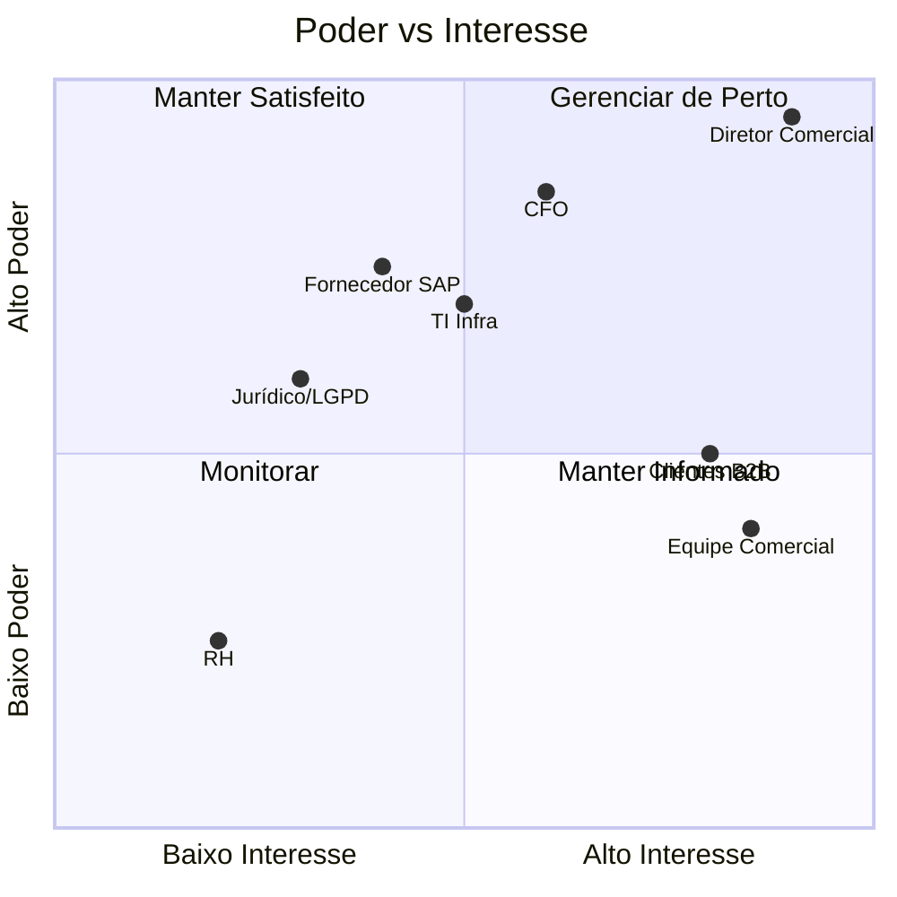

# Matriz de Stakeholders — OrderHub

## Matriz Poder × Interesse

## Registro Detalhado
| # | Stakeholder | Papel | Poder | Interesse | Estratégia | Frequência |
|---|-------------|-------|-------|-----------|-----------|------------|
| 1 | Diretor Comercial | Sponsor | Alto | Alto | Gerenciar de perto | Semanal |
| 2 | CFO | Aprovador financeiro | Alto | Médio | Manter satisfeito | Quinzenal |
| 3 | Gerente TI | Fornece infra | Alto | Médio | Manter satisfeito | Semanal |
| 4 | Equipe Comercial (14p) | Usuário final | Baixo | Alto | Manter informado | Sprint review |
| 5 | Top 20 clientes | Usuário externo | Médio | Alto | Manter informado | Mensal |
| 6 | Fornecedor SAP | Integração | Médio | Alto | Gerenciar de perto | Semanal |
| 7 | Jurídico/DPO | LGPD | Médio | Médio | Manter informado | Mensal |

## Plano de Engajamento
- **Sponsor:** reunião 1:1 semanal 30min + steering mensal
- **Comitê Executivo:** apresentação mensal com Status Report A3
- **Usuários finais:** demos ao fim de cada sprint (2 semanas)
- **Clientes piloto:** grupo focal quinzenal + canal Slack dedicado
