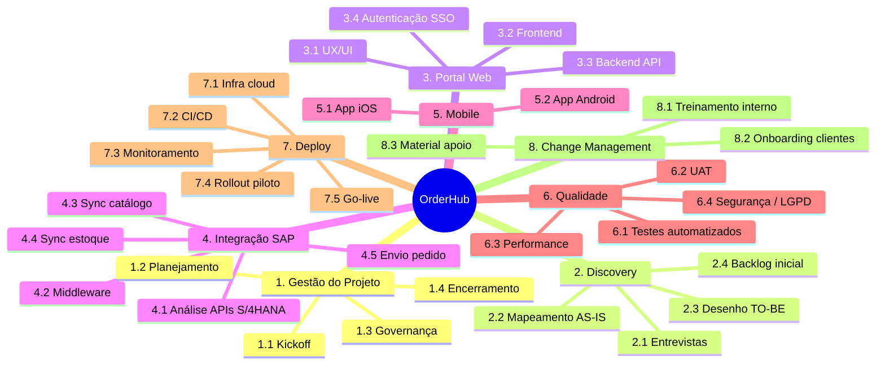

# EAP / WBS — OrderHub

## Dicionário da EAP (extrato)
| ID | Pacote | Entrega | Critério aceite | Responsável |
|----|--------|---------|-----------------|-------------|
| 3.3 | Backend API | 42 endpoints REST + OpenAPI | Cobertura testes ≥80%, latência p95 <400ms | Tech Lead |
| 4.3 | Sync Catálogo | Job hora-hora + delta | 100% SKUs sincronizados, <5min delay | Eng. Integração |
| 6.4 | Segurança/LGPD | Relatório pentest + DPIA | Zero críticas, DPIA assinada | DPO + AppSec |
