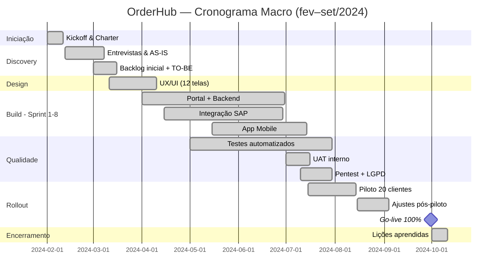

# Cronograma — Gantt

## Marcos Contratuais
| # | Marco | Data | Pagamento |
|---|-------|------|-----------|
| M1 | Charter assinado | 15/02 | 10% |
| M2 | Design aprovado | 10/04 | 20% |
| M3 | MVP interno | 30/04 | 20% |
| M4 | Piloto operando | 15/07 | 25% |
| M5 | Go-live | 30/09 | 25% |
