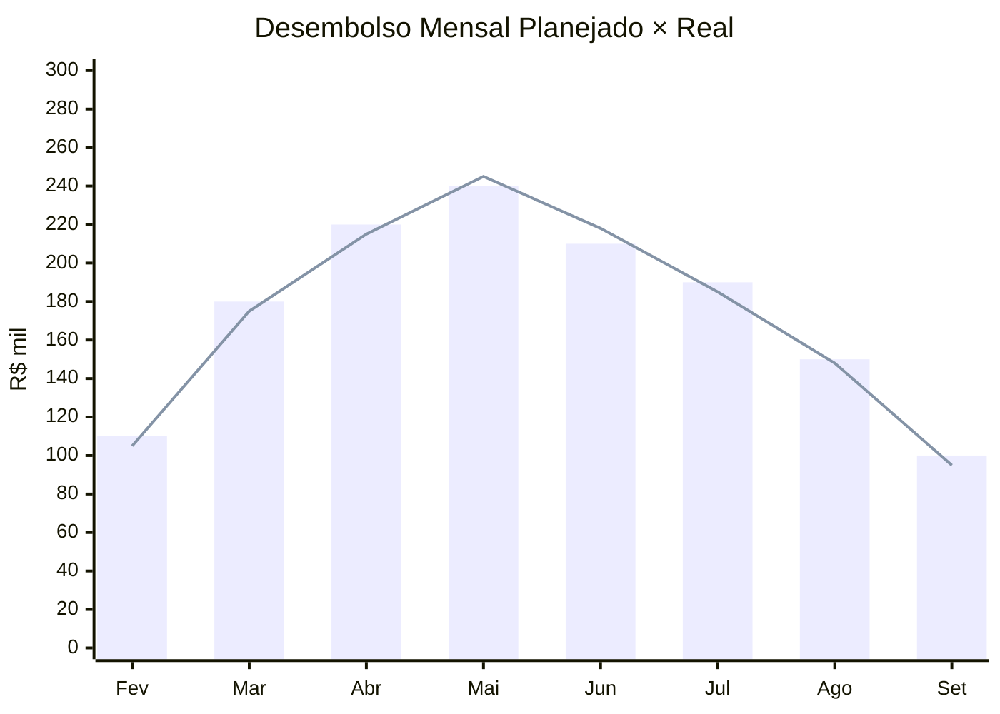

# Orçamento — OrderHub

## Estrutura CAPEX (R$ 1.400.000)
| Categoria | Valor | % |
|-----------|-------|---|
| Time interno (12p × 8m) | 780.000 | 55,7% |
| Consultoria SAP | 210.000 | 15,0% |
| Licenças & ferramentas | 85.000 | 6,1% |
| Infra cloud (setup) | 60.000 | 4,3% |
| UX/UI externo | 90.000 | 6,4% |
| Pentest & auditoria LGPD | 55.000 | 3,9% |
| Treinamento & change | 40.000 | 2,9% |
| Reserva de contingência (10%) | 80.000 | 5,7% |
| **Total** | **1.400.000** | **100%** |

## Curva de Desembolso (R$ mil)

## Variação Final: **-3,2%** (R$ 1.355k realizado)
