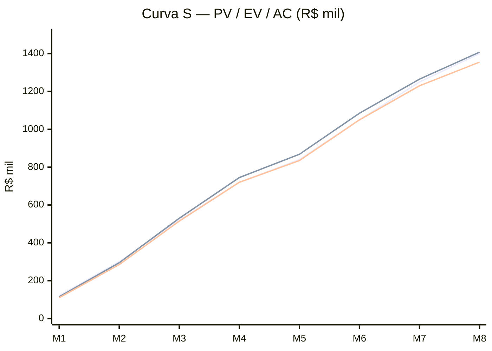

# EVM — Earned Value Management

## Baseline (fim mês 5)
| Métrica | Valor |
|---------|-------|
| BAC (Budget at Completion) | R$ 1.400.000 |
| PV (Planned Value)  | R$ 840.000 |
| EV (Earned Value)   | R$ 868.000 |
| AC (Actual Cost)    | R$ 835.000 |

## Índices
| Índice | Fórmula | Valor | Interpretação |
|--------|---------|-------|---------------|
| CV | EV - AC | +R$ 33.000 | 🟢 Abaixo do custo |
| SV | EV - PV | +R$ 28.000 | 🟢 Adiantado |
| CPI | EV / AC | **1,04** | 🟢 Eficiência custo |
| SPI | EV / PV | **1,03** | 🟢 Eficiência prazo |
| EAC | BAC / CPI | R$ 1.346k | 🟢 Estimativa final |
| VAC | BAC - EAC | +R$ 54k | 🟢 Sobra prevista |

## Curva S

