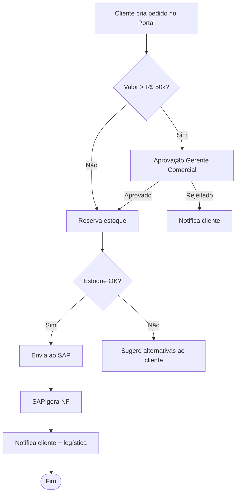

# Fluxo de Aprovação de Pedido

```mermaid
flowchart TD
    A[Cliente cria pedido no Portal] --> B{Valor > R$ 50k?}
    B -->|Não| C[Reserva estoque]
    B -->|Sim| D[Aprovação Gerente Comercial]
    D -->|Aprovado| C
    D -->|Rejeitado| E[Notifica cliente]
    C --> F{Estoque OK?}
    F -->|Sim| G[Envia ao SAP]
    F -->|Não| H[Sugere alternativas ao cliente]
    G --> I[SAP gera NF]
    I --> J[Notifica cliente + logística]
    J --> K([Fim])
```
